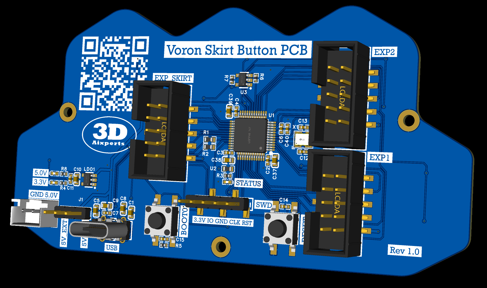

# Voron Skirt Button PCB V1

Pre-flashed and ready to go!

This is our Skirt Button PCB with 7 tactile switches and 2 WS2812 RG LEDs per switch.
It´s controlled by the STM32F072 MCU and delivers the known EXP1 and EXP2 ports to connect for example a 12864mini display as well.
The connection and power supply is via USB from the Pi. CAN is also supportet.

See skirt_button_pcb.cfg for further instructions.

Available here: https://www.3daixperts.de/product-page/voron-skirt-button-pcb
